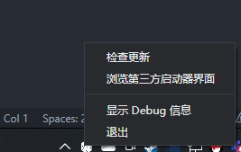

# 快速开始

## 搭建环境

*本文基于 vscode 使用体验撰写，推荐使用 vscode 进行开发*

进入 github 仓库，https://github.com/Voxelum/x-minecraft-launcher-template，点击 Use this template 来创建启动器仓库


本地 clone 刚刚创建的仓库，比如你刚刚的仓库叫 `my-launcher`

```bash
git clone https://github.com/<username>/my-launcher
```

进入仓库文件夹并安装，请确保你有 `nodejs` 和 `pnpm`。

<details>
  <summary>如何安装 pnpm</summary>
  
  详情请看 https://www.pnpm.cn/installation
  
  如果你有 node 可以这样安装
  ```sh
  npm install -g pnpm
  ```
</details>

```bash
cd my-launcher # 进入文件夹
pnpm i # 安装开发环境
```

安装结束后，运行如下命令来启动开发环境

```bash
pnpm dev
```

如果安装成功，你会在命令行中看到如下字样

```
  vite v2.7.13 dev server running at:

  > Local: http://localhost:25555/
  > Network: use `--host` to expose
```

然后请打开 FMCL 加载你的开发环境，
在 托盘 中找到 FMCL 图标，右键选择`浏览第三方启动器界面`



在顶部栏的输入框中输入命令行中的链接地址并在后面加上 `index.html`

如: `http://localhost:25555/index.html`，并点击安装键


安装后你会在界面列表中看到`模板启动器`字样，点击`启动并设置为默认`


然后你就能看到模板启动器界面了


## 使用服务

启动器的核心功能都被封装成 `Service` （服务）了。服务分为2种，有状态的和无状态的。

大部分服务都是有状态的，比如安装服务的状态会保存刷新版本得到的版本列表（如 Minecraft），
用户服务的状态会保存用户登录的状态。

可以通过 `service.state` 访问服务的状态。

### 常用服务方法

| 功能                       | 服务            | 相关方法         | 备注                                                  |
| -------------------------- | --------------- | ---------------- | ----------------------------------------------------- |
| 启动游戏                   | LaunchService   | launch           | 默认启动当前的实例                                    |
| 刷新 Minecraft 版本列表    | InstallService  | refreshMinecraft | 刷新完了需要通过 state（状态） 获得刷新拿到的版本列表 |
| 安装 Minecraft             | InstallService  | installMinecraft | 需要通过 state 拿到需要安装的版本信息作为参数         |
| 安装 Forge                 | InstallService  | installForge     |                                                       |
| 创建实例                   | InstanceService | createInstance   |                                                       |
| 选择实例                   | InstanceService | mountInstance    |                                                       |
| 编辑实例                   | InstanceService | editInstance     |                                                       |
| 刷新当前已经安装的本地版本 | VersionService  | refreshVersions  | 刷新得到的结果会存到 state 里                         |

### 常用服务属性

| 功能                           | 服务               | 相关方法        | 备注                                                                                    |
| ------------------------------ | ------------------ | --------------- | --------------------------------------------------------------------------------------- |
| 获得 Minecraft 版本列表        | InstallService     | state.minecraft |                                                                                         |
| 安装 Forge 版本列表            | InstallService     | state.forge     | 这个列表是根据 Minecraft 版本存储的，如 state.forge['1.18.2'] 就是 1.18.2 的 forge 列表 |
| 获得当前选择的实例的路径       | InstanceService    | state.path      | 配合 state.all[path] 来获得 path 对应的实例配置                                         |
| 所有已知实例                   | InstanceService    | state.instances |                                                                                         |
| 获得实例安装的 Mod 列表        | InstanceModService | state.mods      |                                                                                         |
| 获得**所有**已经安装的 Mod     | ResourceService    | state.mods      |                                                                                         |
| 获取所有已经安装的本地版本列表 | VersionService     | state.local     |                                                                                         |


## 情景

Q：我已经按照流程完成了以上的步骤，现在准备好定制属于我的服务器的专属启动器，目前我需要的基础功能包括但不限于”更新minecraft、forge版本，与服务器同步mod以及配置文件，正版登录或离线登录“，在代码当中是如何具体实现的？
A：
在回答这个问题之前，你需要确保你大概了解 FMCL 的实例 (instance) 机制，并不复杂，详情请看[这个文档](https://xmcl.app/zh/faq)）

为了避免我们服务器的配置和别的启动配置互相干扰，我们需要先申请一个独有的实例
```ts
// 获得启动实例目录
instancePath.value = await instanceService.acquireInstanceById('piggy-server')
await instanceService.mountInstance(instancePath.value)
```

其中 `piggy-server` 是你随意取的独有的启动配置 id，而 `mountInstance` 会确保以后的操作都应用于你的启动配置。

### 你的启动配置

如果你的服务器需要 Minecraft 1.18.2, Forge 40.0.44, 和一堆 Mod。
因为我们模板用 vue，这里用 vue 的实现来举例子，你首先需要在代码中声明他们

```ts
const expectMc = ref('1.18.2') // mc 版本
const expectForge = ref('40.0.44') // forge 版本
const modsLists = ref([
  {
    // mod 路径
    path: "mods/Architectury-4.1.39.09fa85.jar",
    // mod 下载地址
    url: "https://raw.staticdn.net/dozono/PigServerMods/master/mods/Architectury-4.1.39.09fa85.jar",
    // mod 的 sha1
    hash: "09fa853c5eef54b3df2cfafe4d3f76a2101e5b2e"
  }
  //... 省略很多 mod
])
```

有了这些，你就可以通过 vue 的响应式 api 来计算出你需要的启动配置

```ts
// 当前的启动实例
const targetInstance = computed(() => instanceService.state.all[instancePath.value])
// 期望的启动版本
const expectedVersion = computed(() => versionService.state.local.find(v => v.minecraftVersion === expectMc.value && resolveForgeVersion(v) === expectForge.value))
// 期望的 mc 版本
const expectedMinecraftVersion = computed(() => versionService.state.local.find(v => v.minecraftVersion === expectMc.value && v.inheritances.length === 1))
// 需要安装的 mods
const modsToInstalled = computed(() => {
  const installed = instanceModService.state.mods
  return modsLists.value.filter(m => !installed.find(v => v.hash === m.hash))
})
// 是否需要更新启动实例
const needUpdate = computed(() => !expectedVersion || modsToInstalled.value.length > 0)
```

然后你就可以根据情况来安装 Minecraft 或者 Forge 了

```ts
// 如果没有对应的 mc 版本
if (!expectedMinecraftVersion.value) {
  status.status = Status.DownloadMinecraft
  // 安装 minecraft
  const mcVersion = installService.state.minecraft.versions.find(mc => mc.id === expectMc.value)
  await installService.installMinecraft(mcVersion!)
}

// 如果没有对应的 mc + forge 版本
if (!expectedVersion.value) {
  status.status = Status.DownloadForge
  // 安装 forge
  await installService.installForge({
      mcversion: expectMc.value,
      version: expectForge.value,
  })
}
```

之后你需要确保实例中的 mods 等文件都是最新的

```ts
// 如果有 mod 需要装
if (modsToInstalled.value.length > 0) {
  status.status = Status.DownloadUpdate
  // 更新文件
  await instanceIOService.applyInstanceUpdate({
      path: targetInstance.value.path,
      updates: [...toRaw(modsToInstalled.value).map(toRaw)], // 因为 vue 的 object 是 proxy，需要 toRaw 才能发给服务
  })
}
```

最后你需要确保实例选择的版本是正确的版本

```ts
// 如果目标实例版本不等于期望版本
if (targetInstance.value.version !== expectedVersion.value?.id) {
  // 确保启动正确的版本
  await instanceService.editInstance({
      version: expectedVersion.value?.id
  })
}
```

最后你可以启动游戏了

```ts

await launchService.launch({
  launcherName: '你的启动器的名字',
  launcherBranch: '你的启动器的牌子'
})
```


## 服务低级接口

所有客户端访问访问需要通过 `serviceChannel` 来创建和服务的连接：

```ts
import { LaunchServiceKey } from '@xmcl/runtime-api'

// 建立连接
const launchServiceChannel = serviceChannel.open(LaunchServiceKey)
// 使用 service 的方法
launchServiceChannel.call('launch') // 调用启动，启动目标是当前的实例
```

对于有状态的服务，你可以通过 `sync` 拿到当前的状态

```ts
import { InstallServiceKey } from '@xmcl/runtime-api'

const installServiceChannel = serviceChannel.open(InstallServiceKey)

installServiceChannel.sync().then(payload => {
  // 当前 service 的状态
  const state = payload.state
})
installServiceChannel.on('commit', ({ mutation, id }) => {
  if (this.store.state[`services/${service}`].syncing) {
    syncingQueue[id] = mutation
    return
  }
  const newId = lastId + 1
  if (id !== newId) {
    console.log(`Sync conflict from main. Last id in renderer: ${lastId}. Sync from main ${id}`)
    sync()
  } else {
    this.store.commit(mutation.type, mutation.payload)
    lastId = newId
  }
})
```

## 监控任务状态

启动器会在后台跑一些任务，比如下载游戏，安装 forge 等。你可以通过 `taskMonitor` 来监控所有任务。

你需要先调用 `subscribe` 获得所有任务状态，并开始监听任务更新。

```ts
// 开始监听所有任务活动
taskMonitor.subscribe().then((tasks) => {
  // tasks 是当前所有的任务状态
  // 你这里应该把 tasks 存下来并显示在任务管理器中

  // 这里展示任意一个 task 内部结构
  const task = tasks[0]
  task.uuid // 这个是一个 uuid，每个任务唯一
  task.id // 因为有子任务，这个 id 是用来区分子任务的
  const realDistinctId = task.uuid + '@' + task.id // 这是用来完全区别父任务、子任务的
  task.path // 任务的标注名字，比如 installForge.downloadInstaller，用于查找对用的名字，如 `installForge.downloadInstaller` 对应到 `下载 Forge 安装器`
  task.param // 任务的参数，同样是用于生成对应的名字，比如当前任务是下载 Minecraft jar (installVersion)，那 param 里面就会有 `version` 代表当前下载的 Minecraft version
  task.time // 任务上次更新时间
  task.state // 任务状态，是一个数字，你可以看 `TaskState` 这个枚举里面的定义，1 代表正在跑，2 代表被取消了。
  task.progress // 任务进度
  task.total // 任务总长度
  const percentage = task.progress / task.total // 任务进度百分比是进度除以总长度
  task.children // 子任务数组，里面每个东西和 task 结构一致
})
```

在调用 `subscribe` 后，taskMonitor就会通过事件通知你有任务更新状态了

```ts
taskMonitor.on('task-update', (event) => {
  // 新添加的任务
  const adds = event.adds
  // 更新状态的任务
  const updates = event.updates
})
```
